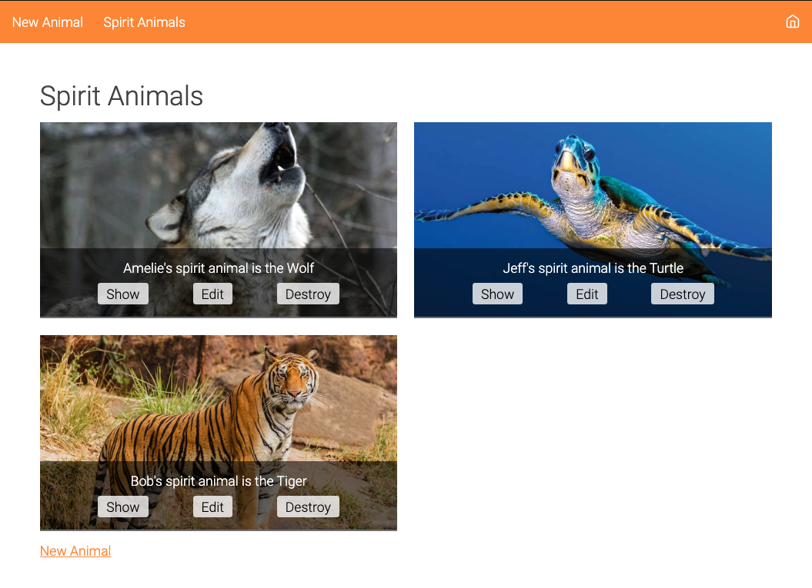

# HTML, CSS, and Design

## Outline

- HTML & CSS
- The Box Model
- Other Tools
  - CSS Resets
  - Using Fonts
  - Media Queries
- Good To Know

## HTML & CSS

### HTML Tags

- Examples of HTML tags: `label`, `p`, `div`
- _Keep in mind that some tags are self-closing (`input`, `img`, `a`)_

### HTML attributes

- Examples of HTML attributes: `class`, `id`, `href`

### CSS Anatomy

### CSS Selectors

- tag selector (`p`, `img`, `input`)
- id selector (`#my-id`)
- class selector (`.my-class`)

### Good To Know

- Use the dev tools to inspect HTML & CSS ([Chrome DevTools](https://developers.google.com/web/tools/chrome-devtools))
- Make your site accessible ([HTML: A good basis for accessibility](https://developer.mozilla.org/en-US/docs/Learn/Accessibility/HTML))

## The Box Model

- Everything is a box!
- Content, padding, border, and margin work together to make up the shape and spacing of elements on the page

### Good To Know

- You may need to set the box sizing property to not run into overlapping issues [box-sizing - CSS: Cascading Style Sheets | MDN](https://developer.mozilla.org/en-US/docs/Web/CSS/box-sizing)

_Let’s draw some grids_

## Other Tools

### CSS Resets

- The goal of a **reset** stylesheet is to reduce browser inconsistencies
- [CSS Tools: Reset CSS](https://meyerweb.com/eric/tools/css/reset/)

### Using Fonts

- One way to use external fonts is to import them via link tags: `<link href=“https://fonts.googleapis.com/css?family=Josefin+Sans|Press+Start+2P&display=swap” rel=“stylesheet”>` (link tags are placed in the `head` of the HTML page)
- Google Fonts has an abundance of free fonts available: [Google Fonts](https://fonts.google.com/)

### Media Queries

- With the help of media queries you can conditionally apply styles based on the screen size and other attributes
- Min & Max Width
  - If [device width] id **less** than or equal to 600px: `@media only screen and (max-width: 600px) {…}`
  - If [device width] is **greater** than or equal to 600px: `@media only screen and (min-width: 600px) {…}`

## Good To Know

- Don’t forget about the hard refresh `cmd + shift+ r` (ignoring the cache and loading all resources from the web page again)
- CSS & the Rails asset pipeline: In `application.css` you can change the order of css files being loaded

## Resources

- [HTML basics](https://developer.mozilla.org/en-US/docs/Learn/Getting_started_with_the_web/HTML_basics)
- [CSS basics](https://developer.mozilla.org/en-US/docs/Learn/Getting_started_with_the_web/CSS_basics)
- [The box model](https://developer.mozilla.org/en-US/docs/Learn/CSS/Building_blocks/The_box_model)
- [Using media queries](https://developer.mozilla.org/en-US/docs/Web/CSS/Media_Queries/Using_media_queries)
- [Chrome DevTools](https://developers.google.com/web/tools/chrome-devtools)
- [HTML: A good basis for accessibility](https://developer.mozilla.org/en-US/docs/Learn/Accessibility/HTML)
- [css grid](https://css-tricks.com/snippets/css/complete-guide-grid/)
